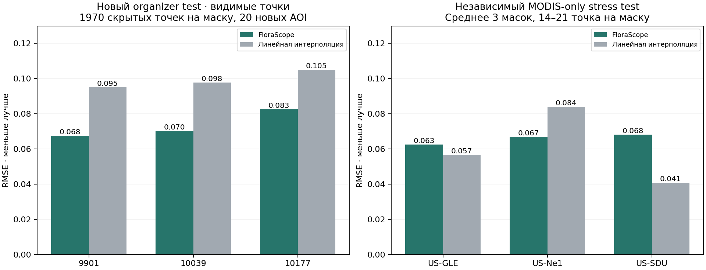

# Проверка после замены test

## Новый test: скрываем известные observations

Исходная production-модель заморожена. На каждом из 20 новых AOI скрыты дополнительные 15% известных observations тем же
`synthetic_mask`. Все dynamic values target row исключены; исходные synthetic gaps также остаются исключёнными.
Секретные ответы не используются. Ни один из этих AOI не встречается в organizer train.

| Seed    | Targets | FloraScope RMSE | Linear RMSE |
|---------|--------:|----------------:|------------:|
| 9901    |    1970 |        0.067510 |    0.095131 |
| 10039   |    1970 |        0.070319 |    0.097672 |
| 10177   |    1970 |        0.082517 |    0.105154 |
| Среднее |       — |        0.073449 |    0.099319 |

Ошибка ниже примерно на 26% относительно linear в среднем трёх масок. Маски могут пересекаться: это не 5910 независимых
точек и не доверительный интервал. Дополнительное masking уменьшает контекст относительно actual test, а видимые
observations могут отличаться от скрытой выборки. Это перенос на новые AOI, не официальный test RMSE. Raw:
`results/new_test_observed_old_model.json`.

## Независимые данные

Получены реальные MOD13Q1 ряды трёх площадок ORNL DAAC: 483 композита за 2018–2024; после порога quality >=80% остался
371. География и provenance — [external/README.md](external/README.md). Окно 1089 пикселей, 250 м, 16-дневная частота;
это существенно другой масштаб относительно organizer. Погода и остальные sensors отсутствуют.

| Площадка              | Принятые даты | Targets на mask | Model mean RMSE | Linear mean RMSE |
|-----------------------|--------------:|----------------:|----------------:|-----------------:|
| Wyoming GLEES         |            75 |              14 |        0.062581 |         0.056704 |
| Mead irrigated maize  |           138 |              20 |        0.066976 |         0.083961 |
| Colorado South Denver |           158 |              21 |        0.068093 |         0.040807 |

Модель выигрывает на maize в среднем, но не на каждой маске. На двух других территориях linear лучше. Это аргумент
против заявления об универсальной точности: MODIS-only перенос без адаптации не гарантирован. Данные оставлены отдельным
stress test, не добавлены в training и не используются для выбора submission. Temporal core также обработал 2024 с
историей 2018–2023; обнаруженное событие не является размеченной агрономической причиной. Raw:
`results/external_modis_check.json`, `results/external_modis_temporal.json`.



## Воспроизведение

Из корня репозитория, Docker Compose; команды подходят для Bash и PowerShell:

```text
docker compose run --rm -v "${PWD}/research:/research" api python /research/updated_schema_check.py
docker compose run --rm -v "${PWD}/research:/research" api python /research/new_test_observed_check.py --model /artifacts/competition_model --output /research/results/new_test_observed_old_model.json
docker compose run --rm -v "${PWD}/research:/research" api python /research/external_modis_check.py
```

Network download выполняется `research/download_external_modis.py` через Python standard library. Raw уже сохранены,
повторный внешний запрос для local evaluation не нужен. График строит `plot_data_checks.py` с matplotlib 3.10.6.

## Удаление двух organizer columns

Одинаковый fast profile, outer masks и inner calibration. Исходный результат каждого seed воспроизведён до 1e-10; веса
не подбирались по outer. Убраны только `ndvi_climatology_mean` и `ndvi_climatology_std`.

| Seed    | Исходная схема | Старое обучение, columns отсутствуют | Переобучение без columns |
|---------|---------------:|-------------------------------------:|-------------------------:|
| 9901    |       0.062175 |                             0.062318 |                 0.062067 |
| 10039   |       0.068772 |                             0.069001 |                 0.068823 |
| 10177   |       0.061637 |                             0.062106 |                 0.061767 |
| Среднее |       0.064195 |                             0.064475 |                 0.064219 |

Переобучение слегка улучшает результат относительно отсутствующих колонок на всех трёх seeds, но величина эффекта около
0.00026 RMSE. Это не доказательство статистической значимости. Raw: `results/updated_schema_check.json`.

## Отдельный production-кандидат

Обучен с новой схемой и inner calibration seed 9901, artifact `competition_model_updated_schema`. Проверка на видимых
точках нового test дала 0.067084 / 0.070144 / 0.082464, среднее **0.073231**
против **0.073449** у текущего production. Выигрыш около 0.3%, без доказанной значимости; размер эффекта мал. Кандидат и
его валидный submission сохранены локально (исключены из Git, воспроизводятся командой ниже) в `artifacts/competition_model_updated_schema/`
и `data/output/updated_schema_candidate/`. Основной production и `data/output/submission.csv` не заменены:
запрос был на проверку данных, существенного выигрыша для срочной замены не найдено.

Воспроизведение кандидата после `updated_schema_check.py`:

```text
docker compose run --rm -v "${PWD}/research:/research" api florascope-core competition --train /data/input/train_updated_schema.csv --input /data/input/private_features.csv --artifacts /artifacts/competition_model_updated_schema --output /data/output/updated_schema_candidate --fast --no-cv --calibration /research/results/cv_updated_schema_9901.json
```

После прогона: 30 pytest passed; текущий и кандидатский submissions прошли validator, 2323 строки каждый. Core,
validation masking и production dependencies не изменялись.
